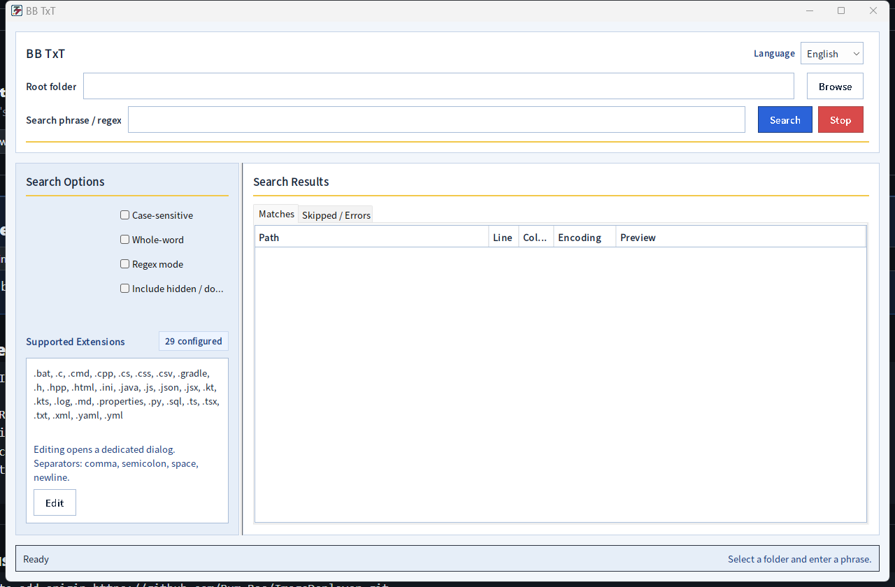
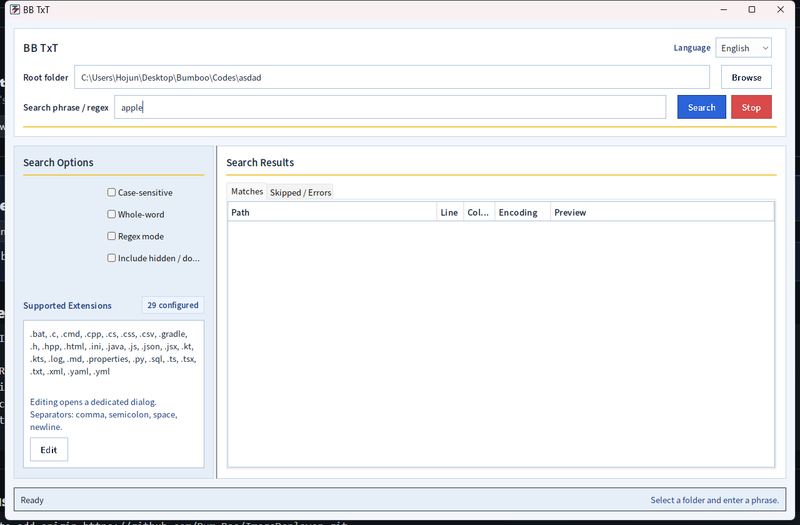
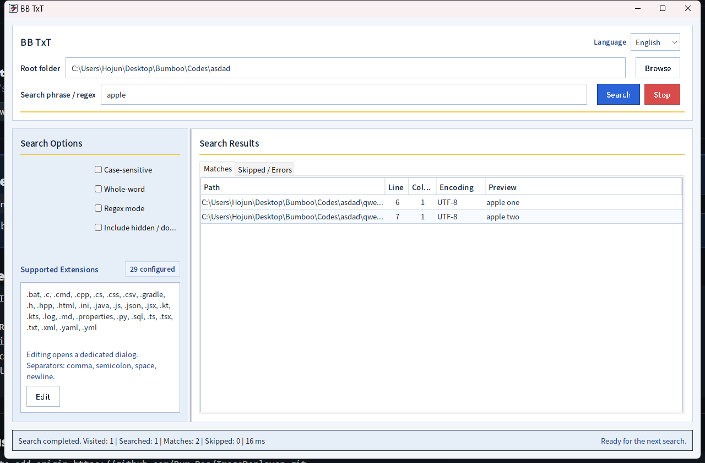

# BB TxT

> Fast local text search for source code, logs, configs, and readable text files.

[Overview](README.md) | [English](docs/readme/README.en.md) | [한국어](docs/readme/README.ko.md) | [中文](docs/readme/README.zh-CN.md) | [日本語](docs/readme/README.ja.md)

| Area | Detail |
|---|---|
| Platform | Java Swing desktop app |
| Search mode | Literal search by default, with case, whole-word, and regex options |
| Release artifact | Windows app-image ZIP |
| UI languages | English, Korean, Japanese, Chinese |

## Preview

The search UI is built around a folder path, a query, and a result table with matched lines.



<details>
<summary>View full demo walkthrough</summary>

The demo flow enters a folder path and a search term, then finds matching lines inside readable text files.

1. Launch the app.
2. Enter the root folder to search.
3. Enter a term such as `apple`.
4. Click `Search`.
5. Review the file name, line number, and matched text in the results table.

The first screen shows fields for the root folder, search term, and search options.


Enter the folder path and a keyword such as `apple`, then click the `Search` button in the top-right area.



After the search finishes, the results table shows the matched file path, line number, and text preview.



</details>

## Quick Start

```powershell
.\gradlew.bat run
```

## Documentation

- [English README](docs/readme/README.en.md)
- [한국어 README](docs/readme/README.ko.md)
- [中文 README](docs/readme/README.zh-CN.md)
- [日本語 README](docs/readme/README.ja.md)

## Notes

This overview is intentionally short. Detailed setup, architecture, limitations, and localized walkthroughs live in the linked README files.
